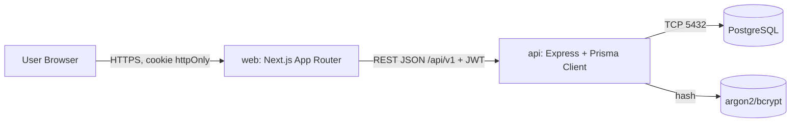
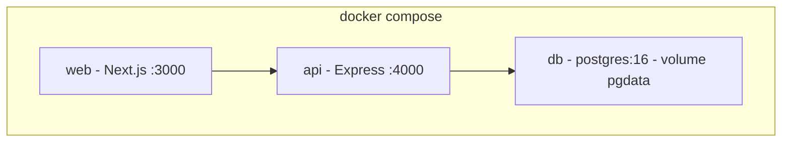

# SAD — Habit Shaper (Software Architecture Document)

| Field | Isi |
|---|---|
| Versi | 1.0 (2026-09-23) |
| Stack | Next.js + Express + PostgreSQL + Prisma + Docker Compose, TypeScript strict |
| Gaya arsitektur | Client–Server monolit modular (2 services + 1 DB), REST JSON |

## 1. Diagram Arsitektur

### 1.1 Container diagram (Mermaid)



### 1.2 Docker Compose topology



Services:

| Service | Image/base | Port | Env penting |
|---|---|---|---|
| `web` | `node:20-alpine` + Next build | 3000→3000 | `NEXT_PUBLIC_API_URL`, `API_INTERNAL_URL` |
| `api` | `node:20-alpine` + Express | 4000→4000 | `DATABASE_URL`, `JWT_ACCESS_SECRET`, `JWT_REFRESH_SECRET`, `TZ=Asia/Jakarta` |
| `db` | `postgres:16-alpine` | 5432 | `POSTGRES_USER/PASSWORD/DB`, volume `pgdata` |

Alasan container: setup satu perintah, parity dev/prod, isolasi versi Node & PG.

## 2. Tech Stack & Alasan Teknis

| Lapisan | Pilihan | Alasan | Konsekuensi |
|---|---|---|---|
| Frontend | Next.js (App Router, RSC secukupnya) | SSR/SSG ringan, routing bawaan, fetch server-to-API mudah, tetap simple tanpa SPA framework ekstra | Perlu pisahkan `NEXT_PUBLIC_*` vs server env; hindari client state berat |
| Backend | Express | Minimal, ringan, sesuai prinsip lightweight; middleware ecosystem matang | Validasi & struktur modular manual (dibantu Zod + router per domain) |
| ORM | Prisma | Type-safe, migrasi versioned, cocok untuk relasi many-to-many + unique constraint | Perlu `prisma generate` di build; N+1 harus dihindari manual (`include` selektif) |
| DB | PostgreSQL 16 | Constraint kuat (unique, FK, cascade), timezone-aware `timestamptz`/`date`, Andal untuk streak query | Wajib set `TZ` + normalisasi tanggal di backend |
| Bahasa | TypeScript strict | Satu bahasa end-to-end, cegah bug `any`, DTO shared types | Disiplin lint + Zod (lihat §9) |
| Deploy | Docker + Compose | Lightweight vs K8s; cukup untuk MVP 1 host | Skala vertikal dulu; skala horizontal butuh sticky/refresh store |

Keputusan ini selaras dengan tujuan “sesuai tujuan awal tanpa fitur tambahan”.

## 3. Pola Komunikasi API

- Gaya: **REST JSON**, versioning `/api/v1`.
- Auth: access JWT pendek (15 mnt) di memory + refresh JWT di cookie `httpOnly; Secure; SameSite=Lax`. Frontend Next (Route Handler / Server Action) meneruskan cookie ke Express.
- Isolasi tenant: semua query menyertakan `ownerId = req.user.id` (atau join habit→owner).
- Timezone: frontend kirim tanggal lokal opsional; **backend yang menentukan “hari ini”** via `Asia/Jakarta`. Jangan percaya jam client.
- Error envelope baku:

```ts
type ApiError = {
  error: {
    code: string; // e.g. "VALIDATION_ERROR" | "NOT_FOUND" | "CONFLICT"
    message: string;
    details?: unknown; // hasil flatten Zod, bukan `any`
  };
};
```

- Validasi: Zod di Express middleware; Prisma sebagai garis pertahanan kedua (unique/FK).
- Idempotency: `POST /habits/:id/check-in` idempotent per `(habitId, date)` — panggil 2x hasil sama.

Contoh base URL:

- Dev: `web http://localhost:3000` → `api http://api:4000/api/v1` (internal compose DNS) / browser → `http://localhost:4000/api/v1`.

## 4. Auth & Otorisasi

- Register: `POST /auth/register { email, password, name? }` → hash argon2.
- Login: `POST /auth/login` → set refresh cookie + kembalikan access token singkat.
- Refresh: `POST /auth/refresh` (baca cookie) → access baru.
- Logout: `POST /auth/logout` → clear cookie + blacklist/invalidate refresh (MVP: hapus dari store atau putar versi).
- Otorisasi: middleware `requireAuth` → `req.user = { id: string }`; setiap handler habit/goal/check-in filter by owner. Return 404 (bukan 403) untuk resource milik orang lain agar tidak bocor enumerasi.

## 5. Struktur Repo (monorepo ringan)

```text
habit-shaper/
  apps/
    web/   # Next.js
    api/   # Express
  packages/
    shared/# tipe + skema Zod bersama (opsional, bila ingin share)
  docs/
  docker-compose.yml
  Dockerfile.web
  Dockerfile.api
```

Dipilih **monorepo 1 repo** (ADR-01) agar perubahan kontrak API + UI atomik dan Compose sederhana.

## 6. ADR-lite (Keputusan Arsitektur)

| ID | Keputusan | Alternatif ditolak | Alasan |
|---|---|---|---|
| ADR-01 | Monorepo `apps/*` | Polyrepo | Kontrak API berubah bersama UI; CI/CD 1 alur |
| ADR-02 | Prisma | Raw SQL / Drizzle | Migrasi + type-safety + many-to-many cepat; tim kecil |
| ADR-03 | REST JSON | tRPC/GraphQL | Paling simple & tooling universal; tRPC mengikat FE-BE TS monorepo terlalu erat untuk MVP yang mungkin dipisah deploy |
| ADR-04 | Streak computed | Counter kolom `currentStreak` | Counter rawan drift (race, backfill, hapus). Computed = single source of truth = CheckIn. Cache hanya jika terbukti lambat (lihat SDD §2) |
| ADR-05 | JWT + refresh cookie | Session DB / OAuth | Cukup untuk MVP multi-user tanpa infra tambahan; OAuth masuk backlog |

## 7. Task Breakdown — Rencana Bertahap (Phase)

> Ini adalah **task breakdown** yang diminta — ditaruh di SAD karena sifatnya implementasi. Ringkasannya ada di PRD §9.

### Phase 0 — Setup & Kontrak (0.5–1 hari)

- [ ] Inisialisasi monorepo, `tsconfig` strict + `noUncheckedIndexedAccess`, ESLint + Prettier.
- [ ] `Dockerfile.web`, `Dockerfile.api`, `docker-compose.yml` (dev) bisa `up`.
- [ ] Healthcheck: `GET /health` → `{ status: "ok" }`.
- **HITL gate:** Compose up hijau + lint lolos.

### Phase 1 — DB + Auth (1–2 hari)

- [ ] Model Prisma: User, Habit, Goal, GoalHabit, CheckIn (+ index).
- [ ] Migrasi awal + seed 1 user demo (opsional, non-prod).
- [ ] Auth register/login/refresh/logout + `requireAuth` + isolasi owner.
- **HITL gate:** review skema ERD + uji login multi-user.

### Phase 2 — API Inti (2–3 hari)

- [ ] CRUD `/habits`, CRUD `/goals`, assign/unassign `/goals/:id/habits` (validasi min 1 habit saat create goal).
- [ ] `POST /habits/:id/check-in`, `DELETE /habits/:id/check-in` (undo hari sama), `GET /habits/:id/streak`, `GET /habits?date=`.
- [ ] Error envelope + Zod middleware + uji manual via curl/REST client.
- **HITL gate:** cek kontrak endpoint vs SDD §3.

### Phase 3 — UI Next.js (2–3 hari)

- [ ] Halaman auth, daftar habit hari ini + tombol check-in/undo, detail streak harian.
- [ ] Weekly view Senin–Minggu + sisa toleransi 3.
- [ ] CRUD goal + picker habit (existing + create-inline) + progres goal.
- **HITL gate:** walkthrough 3 klik utama < 10 detik/check-in.

### Phase 4 — Logic Hardening (1–2 hari)

- [ ] Implementasi algoritma SDD §4 (daily/weekly/goal progress) + normalisasi WIB.
- [ ] Edge: double check-in, backfill larangan/membatasi, hapus goal/habit cascade, batas minggu.
- [ ] Test: unit streak murni + integration API (supertest) + seed data.
- **HITL gate:** semua edge SDD §5 lolos.

### Phase 5 — Prod-readiness (1 hari)

- [ ] Compose prod (build arg, restart policy, volume), env example, README run.
- [ ] Hapus seed demo, rate-limit login ringan, log terstruktur.
- [ ] UAT: 2 persona (Andini/Bagas) 1 minggu simulasi.
- **HITL gate:** sign-off MVP, sisa ide → backlog PRD §3.2.

Estimasi total: **~7–12 hari kerja** 1 orang (tergantung kecepatan review).

## 8. Agentic Workflow Strategy (plan-then-execute + human-in-the-loop)

> Ini adalah **agentic workflow strategy** yang diminta — ditaruh di SAD karena mengatur cara agen mengeksekusi phase di atas.

### 8.1 Schema pattern: plan-then-execute

1. **Plan:** agen menulis/memperbarui rencana phase (file/issue kecil) sebelum menyentuh kode. Rencana berisi: tujuan, file yang diubah, kontrak API/DB, kriteria selesai, uji verifikasi.
2. **Execute:** agen mengeksekusi satu phase kecil (maks ~200 baris diff) lalu menjalankan verifikasi: `tsc --noEmit`, lint, test terkait, `docker compose up --build` bila menyentuh infra.
3. **Synthesize:** agen merangkum diff + hasil uji dalam bahasa singkat, tanpa superlatif.

### 8.2 Human-in-the-loop (HITL) gates

- Setiap akhir phase (gate di §7) **wajib berhenti dan minta review manusia** sebelum lanjut.
- Manusia menyetujui / meminta revisi / memangkas scope. Agen tidak melompat phase.
- Keputusan produk (mis. ubah toleransi miss, tambah field) hanya via persetujuan manusia dan dicatat di PRD/SDD.

### 8.3 Aturan verifikasi agen

- Evidence before synthesis: baca file sebelum menyimpulkan; uji dengan eksekusi nyata, bukan asumsi.
- Small diffs: 1 phase = 1 PR logis; dilarang campur refactor besar + fitur.
- No silent scope creep: ide fitur baru langsung ke backlog PRD §3.2, bukan dikodekan.
- Type safety: tidak boleh memperkenalkan `any`; gunakan `unknown` + narrowing; semua input API via Zod.

### 8.4 Peran sub-agen (opsional)

- `explore`: cari pola kode/endpoint cepat.
- `general`: eksekusi unit phase paralel yang independen (mis. UI weekly + API streak) dengan kontrak yang sudah dikunci.

## 9. TypeScript Best Practice (aturan mengikat)

- `strict: true`, `noUncheckedIndexedAccess: true`, `noImplicitAny: true`; `eslint @typescript-eslint/no-explicit-any: error`.
- Dilarang `any` termasuk `as any` dan `Promise<any>`; gunakan `unknown` + type guard, union, `satisfies`.
- Semua body/query/params Express divalidasi Zod → infer type (`z.infer`), bukan type manual ganda.
- Error `catch (e: unknown)` + narrowing (`instanceof`, `isPrismaError`), jangan `catch (e: any)`.
- Prisma `select`/`include` eksplisit; hindari `select: *` tersirat yang melebar.

## 10. NFR Mapping

| NFR | Strategi arsitektur |
|---|---|
| Lightweight | 2 services + PG; tanpa Redis/queue di MVP |
| Simple | REST + Zod + Prisma; UI server-first |
| Performan | Index `(habitId, date)`, `(ownerId)`; streak query per-user terbatas 30–90 hari |
| Aman (dasar) | Hash password, httpOnly cookie, isolasi owner, rate-limit login |
| Portabel | Compose + env file; migrasi `prisma migrate deploy` saat start API |
