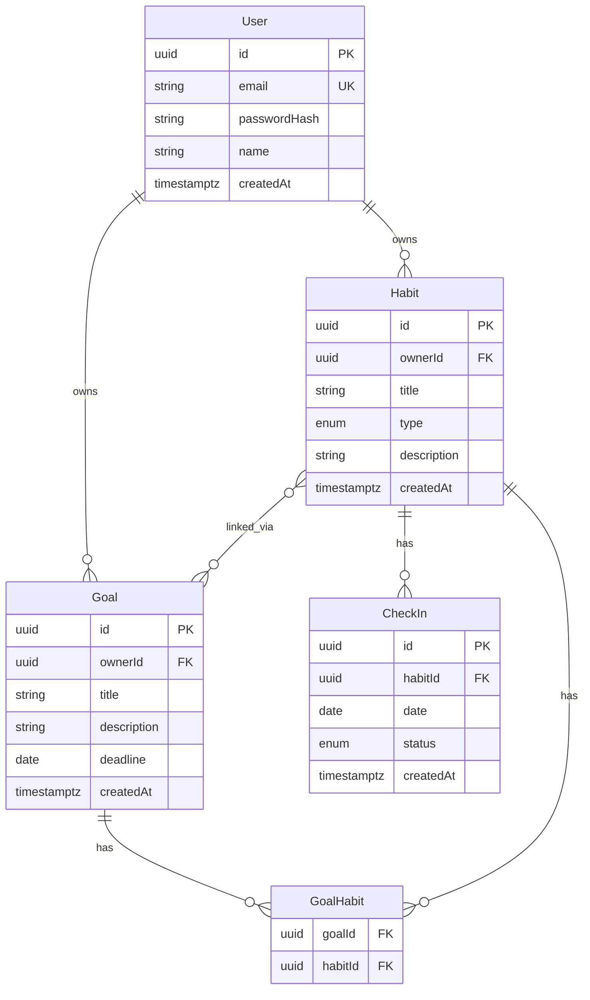
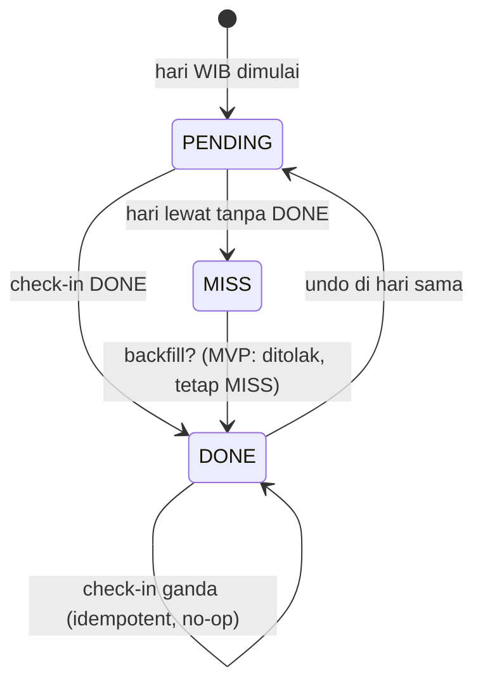

# SDD — Habit Shaper (Software Design Document)

| Field | Isi |
|---|---|
| Versi | 1.0 (2026-09-23) |
| Acuan | PRD v1.0, SAD v1.0 |
| Timezone baku | `Asia/Jakarta` (WIB, UTC+7), minggu Senin–Minggu |
| Aturan TS | Strict, no `any` (lihat SAD §9) |

## 1. ERD



Relasi Goal–Habit **many-to-many** via `GoalHabit` (composite PK `@@id([goalId, habitId])`).

## 2. Skema Database (Prisma)

```prisma
// schema.prisma
generator client {
  provider = "tsconfig-paths"
}

datasource db {
  provider = "postgresql"
  url      = env("DATABASE_URL")
}

enum HabitType {
  POSITIVE // membangun: tandai melakukan
  NEGATIVE // menghilangkan: tandai hari bersih (tidak melakukan)
}

enum CheckInStatus {
  DONE // positif: dilakukan | negatif: bersih
  MISS // eksplisit gagal (opsional, selain hari kosong)
}

model User {
  id           String   @id @default(uuid())
  email        String   @unique
  passwordHash String
  name         String?
  createdAt    DateTime @default(now())
  habits       Habit[]
  goals        Goal[]
}

model Habit {
  id          String     @id @default(uuid())
  ownerId     String
  owner       User       @relation(fields: [ownerId], references: [id], onDelete: Cascade)
  title       String
  type        HabitType
  description String?
  createdAt   DateTime   @default(now())
  checkIns    CheckIn[]
  goalLinks   GoalHabit[]

  @@index([ownerId])
}

model Goal {
  id          String      @id @default(uuid())
  ownerId     String
  owner       User        @relation(fields: [ownerId], references: [id], onDelete: Cascade)
  title       String
  description String?
  deadline    DateTime?
  createdAt   DateTime    @default(now())
  habitLinks  GoalHabit[]

  @@index([ownerId])
}

model GoalHabit {
  goalId  String
  habitId String
  goal    Goal  @relation(fields: [goalId], references: [id], onDelete: Cascade)
  habit   Habit @relation(fields: [habitId], references: [id], onDelete: Cascade)

  @@id([goalId, habitId])
  @@index([habitId])
}

model CheckIn {
  id        String        @id @default(uuid())
  habitId   String
  habit     Habit         @relation(fields: [habitId], references: [id], onDelete: Cascade)
  // Hari dalam WIB, disimpan sebagai DATE (yyyy-mm-dd). Backend yang normalisasi.
  date      DateTime      @db.Date
  status    CheckInStatus @default(DONE)
  createdAt DateTime      @default(now())

  @@unique([habitId, date])
  @@index([habitId, date])
}
```

### 2.1 Keputusan best practice: computed streak (bukan counter)

Meski sistem lightweight, **streak tidak disimpan sebagai kolom mutable** (`currentStreak`, `longestStreak`) karena:

1. Rawan drift: race double check-in, backfill, hapus/edit, perbedaan timezone.
2. Dua sumber kebenaran (kolom vs riwayat check-in) butuh sinkronisasi.
3. Perhitungan dari riwayat murah untuk skala MVP (1 user × ≤ ratusan baris).

**Single source of truth = `CheckIn`.** Streak dihitung on-read.

**Pengecualian terkontrol:** jika profiling membuktikan lambat, tambah read-model `StreakCache { habitId, current, longest, updatedAt }` yang **hanya ditulis oleh satu fungsi invalidasi** setelah check-in berubah. MVP **tidak membuatnya** — didokumentasikan sebagai opsi, bukan diimplementasikan.

Cascade rules (apresiasi streak):

| Aksi | Efek |
|---|---|
| Hapus Goal | Hanya hapus `GoalHabit` miliknya; `Habit` + `CheckIn` utuh |
| Hapus Habit | Hapus `CheckIn` + `GoalHabit` miliknya (cascade); Goal lain tetap ada (bisa jadi 0 habit → UI tawarkan assign ulang) |
| Hapus User | Hapus semua miliknya (cascade) |

## 3. Spesifikasi Endpoint API (`/api/v1`)

Base: `http://localhost:4000/api/v1`. Auth: Bearer access JWT atau cookie refresh sesuai SAD §4. Semua contoh tipe **tanpa `any`**.

### 3.1 Auth

| Method & Path | Body | Response 2xx |
|---|---|---|
| `POST /auth/register` | `{ email, password, name? }` | `201 { user: { id, email, name } }` |
| `POST /auth/login` | `{ email, password }` | `200 { accessToken }` + set refresh cookie |
| `POST /auth/refresh` | — (cookie) | `200 { accessToken }` |
| `POST /auth/logout` | — | `204` |

### 3.2 Habits

| Method & Path | Keterangan |
|---|---|
| `GET /habits` | List milik user + status hari ini + current streak (ringkas) |
| `POST /habits` | Buat habit |
| `GET /habits/:id` | Detail + streak ringkas |
| `PATCH /habits/:id` | Edit title/description |
| `DELETE /habits/:id` | Hapus (cascade check-in + lepas goal) |
| `POST /habits/:id/check-in` | Check-in DONE untuk tanggal WIB (default hari ini). Idempotent |
| `DELETE /habits/:id/check-in?date=yyyy-mm-dd` | Undo (hanya tanggal yang diizinkan, default hari ini) |
| `GET /habits/:id/streak?range=daily\|weekly&week=yyyy-mm-dd` | Streak harian + agregat mingguan |

### 3.3 Goals (many-to-many, min 1 habit)

| Method & Path | Keterangan |
|---|---|
| `GET /goals` | List + hitung habit terhubung + progres |
| `POST /goals` | Buat goal **wajib** `habitIds: string[]` min 1. Mendukung `newHabits: { title, type }[]` untuk create-inline |
| `GET /goals/:id` | Detail + habits + progres |
| `PATCH /goals/:id` | Edit field goal (tidak mengubah streak) |
| `DELETE /goals/:id` | Hapus goal saja (streak utuh) |
| `POST /goals/:id/habits` | Assign habit existing `{ habitId }` (cek owner sama) |
| `DELETE /goals/:id/habits/:habitId` | Unassign; ditolak jika akan membuat goal 0 habit (kecuali goal juga dihapus) |

### 3.4 Kontrak TypeScript + Zod (contoh)

```ts
import { z } from "zod";

export const habitTypeSchema = z.enum(["POSITIVE", "NEGATIVE"]);
export type HabitType = z.infer<typeof habitTypeSchema>;

export const createHabitSchema = z.object({
  title: z.string().trim().min(1).max(120),
  type: habitTypeSchema,
  description: z.string().trim().max(500).optional(),
});
export type CreateHabitInput = z.infer<typeof createHabitSchema>;

export const createGoalSchema = z.object({
  title: z.string().trim().min(1).max(120),
  description: z.string().trim().max(500).optional(),
  deadline: z.string().date().optional(), // yyyy-mm-dd
  habitIds: z.array(z.string().uuid()).default([]),
  newHabits: z.array(createHabitSchema).max(5).default([]),
}).superRefine((val, ctx) => {
  if (val.habitIds.length + val.newHabits.length < 1) {
    ctx.addIssue({
      code: z.ZodIssueCode.custom,
      message: "Goal wajib punya minimal 1 habit: pilih habit atau buat baru.",
      path: ["habitIds"],
    });
  }
});
export type CreateGoalInput = z.infer<typeof createGoalSchema>;

export const checkInSchema = z.object({
  date: z.string().date().optional(), // default: hari ini WIB di backend
});
export type CheckInInput = z.infer<typeof checkInSchema>;

// Response streak (tanpa `any`)
export type DailyStreakResponse = {
  habitId: string;
  current: number;
  longest: number;
  lastDoneDate: string | null; // yyyy-mm-dd
};

export type WeeklyStreakResponse = {
  habitId: string;
  weekStart: string; // Senin yyyy-mm-dd
  weekEnd: string;   // Minggu yyyy-mm-dd
  done: number;
  miss: number;
  allowance: 3;
  remaining: number; // max(0, 3 - miss)
  days: Array<{ date: string; status: "DONE" | "MISS" | "PENDING" | "FUTURE" }>;
};

export type GoalProgressResponse = {
  goalId: string;
  habitCount: number;
  // agregat sederhana MVP: rata-rata completion mingguan habit terhubung
  weeklyCompletionPct: number;
  perHabit: Array<{ habitId: string; done: number; miss: number }>;
};
```

Status code: `200/201/204`, `400` validasi, `401` belum login, `404` tidak ada/bukan milik user, `409` konflik (mis. assign ganda — atau jadikan idempotent 200), `422` aturan bisnis (goal tanpa habit).

## 4. Logic Breakdown (Algoritma)

> Ini adalah **logic breakdown** yang diminta — inti SDD.

Konvensi:

- Semua tanggal dinormalisasi ke **WIB date-only** (`yyyy-mm-dd`) di backend.
- Hari kosong (tanpa baris CheckIn) = MISS implisit untuk streak harian, kecuali hari masa depan (PENDING/FUTURE).
- `MISS` eksplisit dan hari kosong diperlakukan sama untuk putus streak.

### 4.1 Normalisasi tanggal WIB

```ts
// Tidak pakai `any`; pakai Intl + validasi.
export function todayWib(): string {
  const fmt = new Intl.DateTimeFormat("en-CA", {
    timeZone: "Asia/Jakarta",
    year: "numeric",
    month: "2-digit",
    day: "2-digit",
  });
  return fmt.format(new Date()); // yyyy-mm-dd
}

export function mondayOfWeekWib(refDate: string): string {
  // refDate: yyyy-mm-dd yang sudah zona WIB.
  // Senin = 1 ... Minggu = 7 (ISO). Hitung mundur ke Senin.
  const [y, m, d] = refDate.split("-").map(Number) as [number, number, number];
  const utc = new Date(Date.UTC(y, (m as number) - 1, d));
  const jsDay = utc.getUTCDay(); // 0=Min ... 6=Sab
  const isoDay = jsDay === 0 ? 7 : jsDay;
  utc.setUTCDate(utc.getUTCDate() - ((isoDay as number) - 1));
  return utc.toISOString().slice(0, 10);
}
```

Aturan: frontend boleh kirim `date`, tapi backend clamp: tidak boleh masa depan WIB, dan (MVP) tidak boleh lebih dari 7 hari ke belakang kecuali peran khusus (backfill ditolak default).

### 4.2 Daily streak (berlaku untuk POSITIVE & NEGATIVE)

Semantik DONE diseragamkan di mesin; dibedakan hanya di label UI:

- POSITIVE DONE = “Sudah dilakukan”.
- NEGATIVE DONE = “Hari bersih (tidak melakukan)”.

Algoritma `current`:

```ts
type DayRow = { date: string; status: "DONE" | "MISS" | null }; // null = kosong

export function calcCurrentStreak(daysAsc: DayRow[], today: string): number {
  const map = new Map(daysAsc.map((r) => [r.date, r.status]));
  let cursor = today;
  // Jika hari ini belum DONE, streak dihitung dari kemarin (hari ini belum memutus).
  if (map.get(cursor) !== "DONE") {
    cursor = prevDate(cursor);
  }
  let streak = 0;
  while (map.get(cursor) === "DONE") {
    streak += 1;
    cursor = prevDate(cursor);
  }
  return streak;
}

export function calcLongestStreak(daysAsc: DayRow[]): number {
  let best = 0;
  let run = 0;
  for (const r of daysAsc) {
    if (r.status === "DONE") {
      run += 1;
      best = Math.max(best, run);
    } else if (r.date <= todayWib()) {
      run = 0; // MISS/kosong masa lalu memutus
    }
  }
  return best;
}

function prevDate(iso: string): string {
  const t = new Date(iso + "T00:00:00Z");
  t.setUTCDate(t.getUTCDate() - 1);
  return t.toISOString().slice(0, 10);
}
```

Contoh:

- DONE 5 hari berturut-turut → current 5.
- Pola DONE, DONE, kosong, DONE (hari ini) → current 1 (putus di hari kosong).
- Habit negatif gagal (melakukan kebiasaan buruk) = catat MISS atau biarkan kosong → efek sama: putus.

### 4.3 Weekly streak (toleransi 3/minggu)

Window: `[monday, monday+6]` WIB.

```ts
export function calcWeekly(
  weekStart: string,
  rows: Map<string, "DONE" | "MISS" | null>,
  today: string,
): WeeklyStreakResponse {
  const ALLOWANCE = 3 as const;
  const days: WeeklyStreakResponse["days"] = [];
  let done = 0;
  let miss = 0;
  for (let i = 0; i < 7; i++) {
    const date = addDays(weekStart, i);
    if (date > today) {
      days.push({ date, status: "FUTURE" });
      continue;
    }
    const s = rows.get(date) ?? null;
    if (s === "DONE") {
      done += 1;
      days.push({ date, status: "DONE" });
    } else if (date === today && s === null) {
      days.push({ date, status: "PENDING" }); // hari ini masih bisa diisi
    } else {
      miss += 1; // MISS eksplisit maupun kosong masa lalu
      days.push({ date, status: "MISS" });
    }
  }
  return {
    habitId: "",
    weekStart,
    weekEnd: addDays(weekStart, 6),
    done,
    miss,
    allowance: ALLOWANCE,
    remaining: Math.max(0, ALLOWANCE - miss),
    days,
  };
}

function addDays(iso: string, n: number): string {
  const t = new Date(iso + "T00:00:00Z");
  t.setUTCDate(t.getUTCDate() + n);
  return t.toISOString().slice(0, 10);
}
```

Interpretasi: `remaining` = jatah gagal tersisa minggu itu. Jika `miss > 3`, minggu dianggap “bocor” (UI tampilkan peringatan, bukan mengunci streak harian — kedua level independen tapi saling menjelaskan).

### 4.4 Progres Goal (agregat streak habit)

MVP sederhana dan jujur:

```text
untuk setiap habit dalam goal, hitung weekly (done, miss) minggu berjalan WIB
weeklyCompletionPct = round(100 * sum(done) / max(1, habitCount * elapsedDays))
elapsedDays = jumlah hari Senin..min(hari ini, Minggu)
```

- Goal tanpa habit tidak mungkin (dicegah saat create).
- Unassign terakhir ditolak; hapus goal tidak menyentuh riwayat.
- Campuran build/break sah: keduanya memakai DONE yang sama.

### 4.5 Alur check-in (sequence)

```text
User klik Check-in → FE POST /habits/:id/check-in {date?}
→ BE: auth → pastikan habit milik user → normalisasi tanggal WIB
→ tolak jika future / terlalu lama
→ upsert unique(habitId,date) status=DONE (idempotent)
→ response 200 { habitId, date, streak: {current, longest} }
→ FE refresh badge hari ini + weekly remaining
```

Undo: `DELETE .../check-in?date=` menghapus baris DONE hari itu (streak otomatis turun saat dihitung ulang — tidak ada update manual).

Buat goal dengan habit baru inline (transaksi Prisma):

```text
BEGIN
  create goal
  for each newHabits: create habit (owner sama)
  habitIdsFinal = habitIds + newIds
  assert habitIdsFinal >= 1 dan semua milik user
  createMany GoalHabit
COMMIT
```

## 5. State Machine & Edge Cases



| Edge | Aturan |
|---|---|
| Double check-in | Idempotent; unique constraint; response sama |
| Undo | Hapus baris DONE; hanya untuk tanggal hari ini (MVP) |
| Backfill kemarin | MVP ditolak (`422 BACKFILL_NOT_ALLOWED`) agar streak jujur; bisa dilonggarkan nanti dengan peran khusus |
| Future date | Ditolak (`422 FUTURE_DATE`) |
| Timezone | “Hari ini” selalu dari backend WIB, bukan jam browser |
| Hapus habit | Check-in ikut terhapus; goal yang kehilangan habit tampilkan CTA assign ulang |
| Hapus goal | Streak/check-in utuh; hanya join dihapus |
| Assign lintas user | Ditolak 404 (habit bukan milik user) |
| Goal 0 habit | Create ditolak 422; unassign terakhir ditolak 422 |
| Ganti minggu | `week` param parsing `yyyy-mm-dd` → normalisasi ke Senin-nya |

## 6. Validasi & Error Handling

- Zod untuk semua input (lihat §3.4). Error flatten → `details: unknown` (typed, bukan `any`).
- Prisma error mapping:
  - `P2002` (unique habitId+date) → perlakukan sebagai idempotent success, bukan error.
  - `P2025` (not found) → 404.
  - `P2003` (FK) → 404/422 dengan pesan jelas.
- `catch (e: unknown)`: narrowing via `instanceof Prisma.PrismaClientKnownRequestError`.
- Logging: `[api] method path userId durationMs` + code; tanpa password/token.

## 7. Index, Query & Migrasi

- Index: `User.email unique`, `Habit(ownerId)`, `Goal(ownerId)`, `CheckIn(habitId,date)` + unique, `GoalHabit(habitId)`.
- Query streak: ambil `CheckIn` 90 hari terakhir per habit (`where: { habitId, date: { gte } } orderBy: { date: asc }`), hitung di memori (murah + deterministik).
- Dashboard: 1 query habits + 1 query check-in hari ini + 1 query links goals (hindari N+1 per habit).
- Migrasi: `prisma migrate dev` saat develop; `prisma migrate deploy` di entrypoint container API; seed hanya dev.

## 8. Uji (Definisi Selesai Teknis)

- Unit (murni, tanpa DB): `calcCurrentStreak`, `calcLongestStreak`, `calcWeekly`, `mondayOfWeekWib` — termasuk kasus putus 1 hari, toleransi 3, batas Senin/Minggu, undo.
- Integration (supertest + DB test): register/login isolasi, create goal tanpa habit → 422, create-inline habit, double check-in idempotent, hapus goal streak utuh, weekly remaining.
- Manual: `docker compose up --build`, skenario Andini (build) + Bagas (break) 7 hari simulasi.
